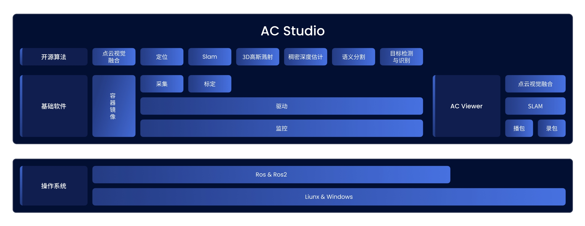

# AC Studio简介
AC Studio 是面向开发者的一站式工具套件，旨在简化开发流程、加速算法落地，充分释放 AC 系列硬件平台的性能潜力。AC Studio 包括了AC Viewer、基础软件和开源算法，其中 AC Viewer 是一个快速开始工具，，基础软件提供了包括驱动、采集、监控、标定等在内的多项软件开发工具包，开源算法则在 AC 系列传感器上展示了前沿算法的效果，体现了 AC 系列传感器的更多可能。  

