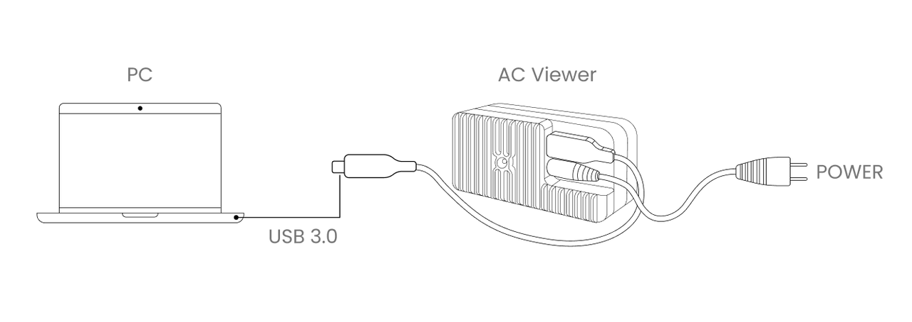

# Active Camera  

AC Viewer 是一款专为 Active Camera 设计的软件，可用于实时显示连接至计算机的所有 Active Camera 的数据（包括点云、图像等）。通过 AC Viewer，用户可轻松查看、记录并储存传感器数据，以便后期使用。  

**硬件准备：** Active Camera x 1，电源线，数据线，PC x 1  

**物理连接：**
  

**软件准备：**
