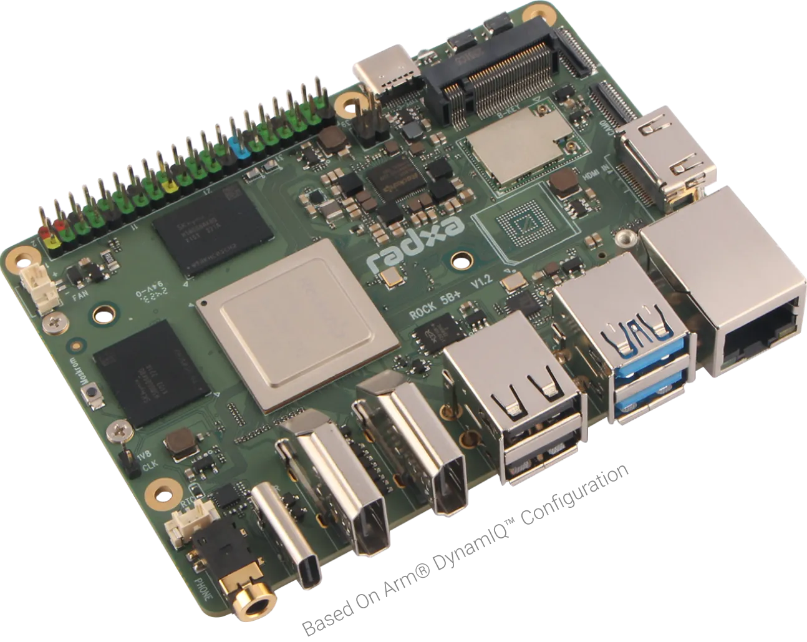

# 配件
## 开发板
### Radxa ROCK5B+

Radxa ROCK5B+ 是一款基于 RK3588 芯片组的优雅单板计算机（SBC），由 Radxa 公司设计，主要面向开发者、创客及高性能嵌入式应用场景，其参数规格如下所示  

    <table class="docutils align-default">
        <thead>
            <tr class="row-odd" align="left">
                <th class="head" colspan=5>Radxa ROCK5B+</th>
            </tr>
        </thead>
        <tbody>
            <tr class="row-even">
                <td>MCU</td>
                <td colspan=4>Rockchip RK3588</td>
            </tr>
            <tr class="row-odd">
                <td>CPU</td>
                <td colspan=2>8核64位处理器 4 个 Cortex-A76@2.4GHz 4 个 Cortex-A55@1.8GHz</td>
                <td>NPU</td>
                <td>支持 INT4/INT8/INT16/FP16/BF16 和 TF32 加速， AI 算力 6 TOPS@INT8</td>
            </tr>
            <tr class="row-even">
                <td>RAM</td>
                <td colspan=2>16 GB LPDDR5</td>
                <td>存储</td>
                <td>板载 eMMC：64 GB MicroSD卡插槽 M.2 M Key 插槽：支持 M.2 2280 NVMe SSD （PCIe 3.0 4Lane）</td>
            </tr>
            <tr class="row-odd">
                <td>多媒体</td>
                <td colspan=4>硬件解码：H.265/H.264/AV1/AVS2 8K@60fps 硬件编码：H.265/H.264 8K@30fps</td>
            </tr>
            <tr class="row-even">
                <td rowspan=5>接口</td>
                <td>显示输出接口</td>
                <td colspan=3>2 x HDMI 输出：2 x 4K@60fps / 1 x 8K@60fps 1 x DP（C 型）输出：4K@60fps 1 x MIPI DSI 输出：1080p@60fps</td>
            </tr>
            <tr class="row-odd">
                <td style="border-left-width: 1px;">显示输入接口</td>
                <td colspan=3>1 x HDMI 输入：4K@60fps</td>
            </tr>
            <tr class="row-even">
                <td style="border-left-width: 1px;">相机接口</td>
                <td>2 x MIPI CSI 4 Lane / 2 Lane</td>
                <td>USB</td>
                <td>2 x USB2.0 2 x USB3.0 HOST/OTG</td>
            </tr>
            <tr class="row-odd">
                <td style="border-left-width: 1px;">无线网络接口</td>
                <td>板载 WiFi Realtek 8852BE +  BT 5.2</td>
                <td>有线网络接口</td>
                <td>2.5G 以太网（支持 POE ）</td>
            </tr>
             <tr class="row-even">
                <td style="border-left-width: 1px;">按键</td>
                <td>1 x MaskRom键 1 x 开关机键</td>
                <td>扩展口</td>
                <td width="10%">2.54mm 40PIN 双排插针：PIN 2 和 4 提供 DC 5V 电源输出，其余可配置 UART、PWM、 I2C、 SPI、CAN、GPIO 等功能接口</td>
            </tr>
            <tr class="row-odd">
                <td>供电</td>
                <td colspan=4>USB Type-C PD 2.0 供电：支持 9V@2A、12V@2A、15V@2A 和 20V@2A</td>
            </tr>
            <tr class="row-even">
                <td>尺寸</td>
                <td colspan=4>100mm x 75 mm</td>
            </tr>
        </tbody>
    </table>

开发板详细链接：[点击了解详情](https://radxa.com/products/rock5/5bp)  

镜像下载：  

ros2编译镜像：