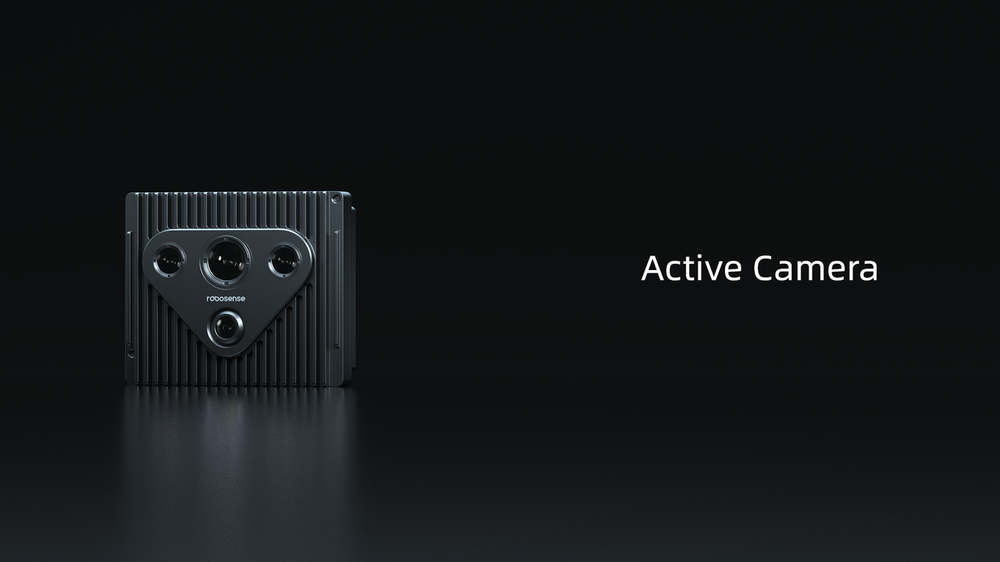

# 传感器
## Active Camera

为应对机器人技术中环境感知和操作认知的难题，RoboSense 通过集成多传感器，创造性发明了传感器平台 Active Camera。为大幅降低开发门槛，提高开发效率，使开发人员能够专注于高价值的任务和功能优化，Active Camera 配备了 AI-Ready 生态，提供了包括驱动程序、标定、数据融合、SLAM 和高阶多模态感知算法等基础工作和高级工具，协助开发者实现通用、高效和优雅的解决方案，打造行为更智能、功能更丰富的机器人。  

点击了解详情：
